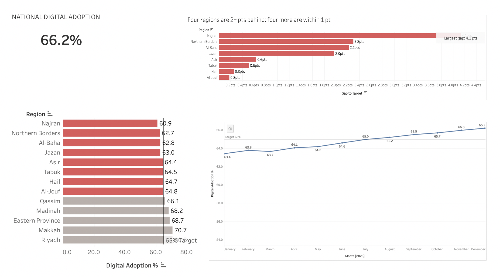

# Tayseer Digital Adoption · Capstone Project

**SDAIA Academy · SDA-DSC-112 · Data Visualization & Storytelling**

A decision-ready executive story built from a Tableau dashboard, recommending where Tayseer should direct the next **SAR 40 million** to lift lagging regions toward the **65% digital-adoption target**.

---

## Team

| Name | GitHub | Presentation role |
|---|---|---|
| Abdulaziz Alfuraih | [@A-EDU](https://github.com/A-edu) | Slides 1–2 · BLUF and national situation |
| Abdulmajeed Alnashwan | [@a-Nash1](https://github.com/a-Nash1) | Slides 3–4 · Regional gap and evidence |
| Naif Alsmari | [@username](https://github.com/Naxf1) | Slide 5 · Options |
| Khalid Alhaidary | [@k-alh](https://github.com/k-alh) | Slides 6–7 · Recommendation and ask|

---

## What we did

1. **Built an interactive Tableau dashboard** from the `tayseer_services_synth` dataset to track digital adoption nationally and by region.
2. **Framed the decision** for a Steering Committee: where should the next SAR 40M go to help lagging regions reach 65% adoption by December?
3. **Found the story in the data:**
   - Nationally, Tayseer is **above target**: adoption reached **66.2%** in December 2025, after crossing 65% in July.
   - But **8 of 13 regions are still below 65%**, hidden by the national average.
   - The gaps split into two clear groups: **four regions 2+ points behind** (Najran, Northern Borders, Al-Baha, Jazan) and **four within 1 point** (Asir, Tabuk, Hail, Al-Jouf).
   - **87% of the total 12.2-point gap** sits in the four far-behind regions.
4. **Compared three options:** split the money evenly, target the 8 lagging regions by gap, or invest in one channel nationally.
5. **Built a seven-slide executive story** (BLUF → Situation → Complication → Evidence → Options → Recommendation → Ask) and a timed 7-minute briefing.

### Big Idea

> Tayseer is above target nationally at 66.2%, but 8 of 13 regions are not. Funding them by size of gap puts 87% of the money where the gap is widest.

### Recommendation

Approve **SAR 40M for the 8 regions below 65%, weighted by each region's gap** (share = region gap ÷ 12.2 pts):

| Region | Adoption (Dec 2025) | Gap to 65% | Share | SAR |
|---|---|---|---|---|
| Najran | 60.9% | 4.1 pts | 33.6% | 13.4M |
| Northern Borders | 62.7% | 2.3 pts | 18.9% | 7.5M |
| Al-Baha | 62.8% | 2.2 pts | 18.0% | 7.2M |
| Jazan | 63.0% | 2.0 pts | 16.4% | 6.6M |
| Asir | 64.4% | 0.6 pts | 4.9% | 2.0M |
| Tabuk | 64.5% | 0.5 pts | 4.1% | 1.6M |
| Hail | 64.7% | 0.3 pts | 2.5% | 1.0M |
| Al-Jouf | 64.8% | 0.2 pts | 1.6% | 0.7M |
| **Total** | | **12.2 pts** | **100%** | **40.0M** |

Progress is reviewed monthly on the dashboard, with a mid-point decision gate to move funds away from any region that isn't improving.

---

## The dashboard

**Live dashboard:** [View on Tableau Public](https://public.tableau.com/app/profile/abdulaziz.alfuraih/viz/AbdulazizsDashboard/TayseerDigitalAdoption)

| View | What it shows |
|---|---|
| **KPI** | National digital adoption for the latest month (66.2%) |
| **National Trend** | Monthly adoption across 2025 against the 65% target line |
| **Regional Adoption** | All 13 regions, sorted, with below-target regions highlighted in red |
| **Gap to Target** | Points each lagging region is short of 65% (calculated field: `65 - [Digital Adoption %]`) |
| **Far-Behind Trend** | 2025 trend for Najran, Northern Borders, Al-Baha and Jazan |

**Interactions:** a Region filter applied across sheets, and a Month filter set to December 2025 for the regional views.

---

## Tools

- **Tableau Public:** data preparation, calculated fields, dashboard and charts
- **Microsoft PowerPoint:** seven-slide executive presentation
- **GitHub:** project submission and version control

---

## Repository contents

| File | Description |
|---|---|
| `Tayseer_Final.pptx` | The seven-slide executive presentation |
| `Tayseer_Final.pdf` | PDF version for viewing in the browser |
| `dashboard.png` | Screenshot of the final Tableau dashboard |
| `README.md` | This file |

---

## Acknowledgements

Completed as part of the **SDAIA Academy** Data Visualization & Storytelling program.
SDAIA GitHub: (https://github.com/SDAIAAcademy)
